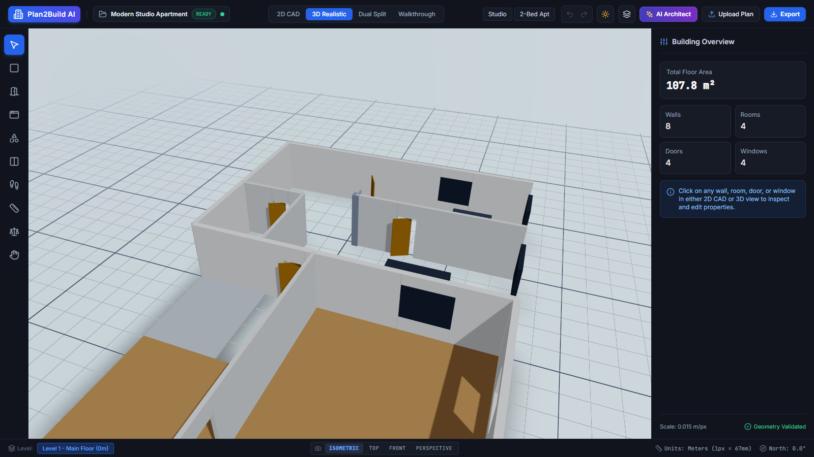
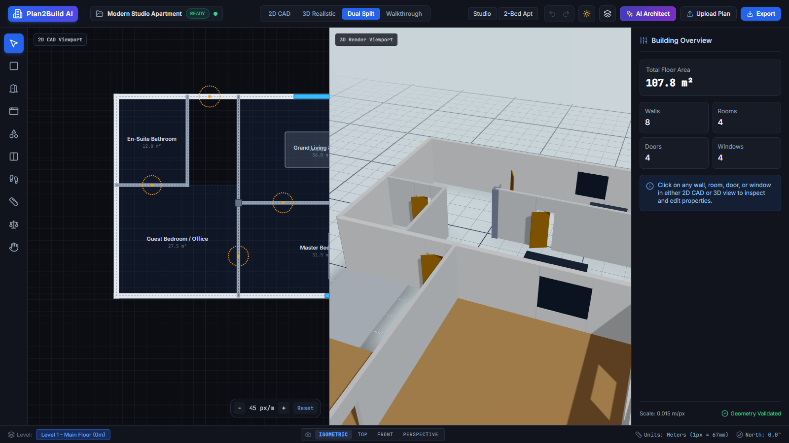
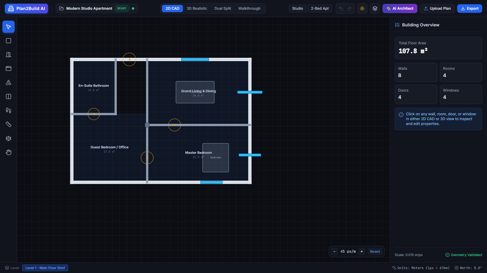
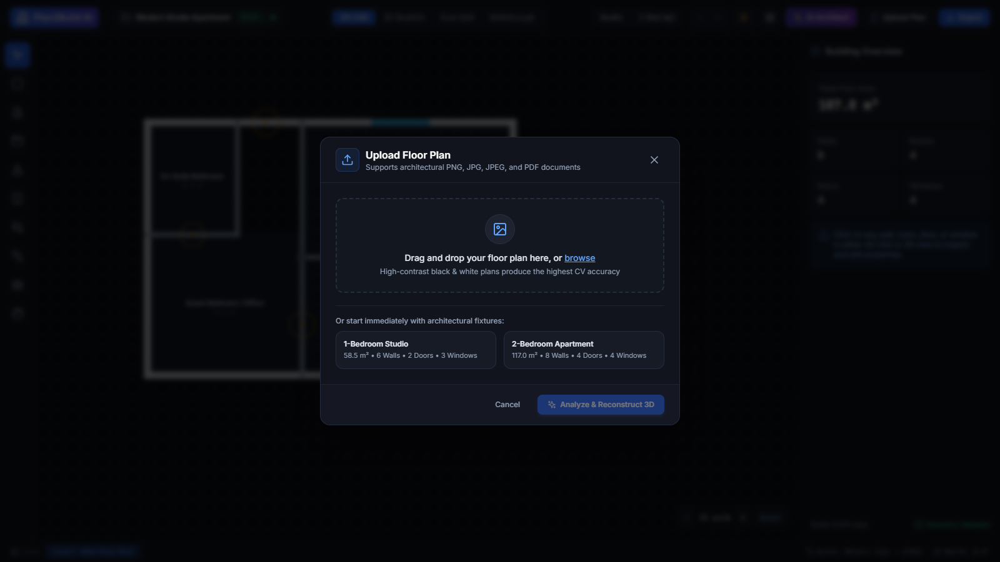
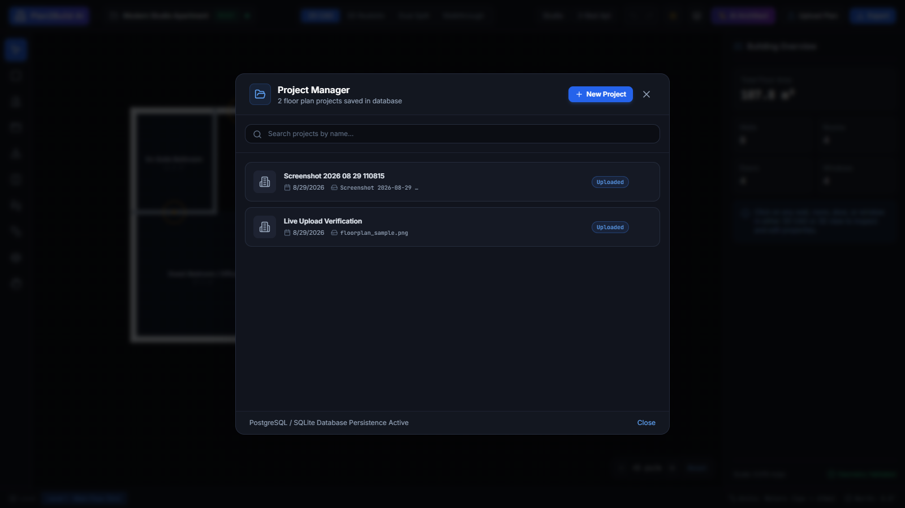
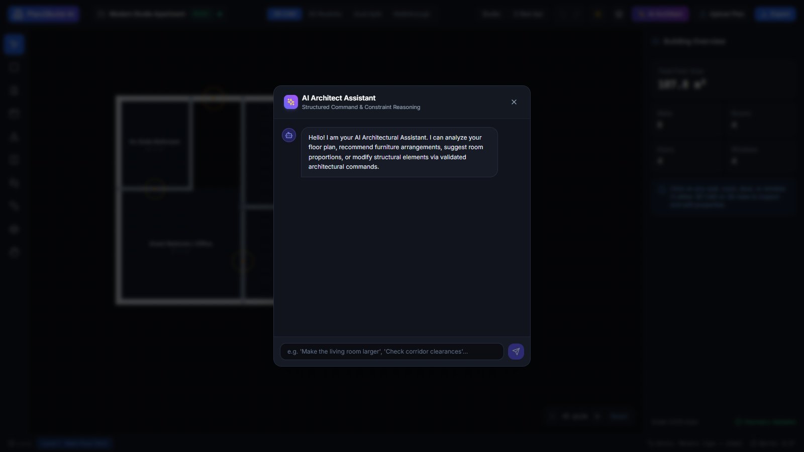
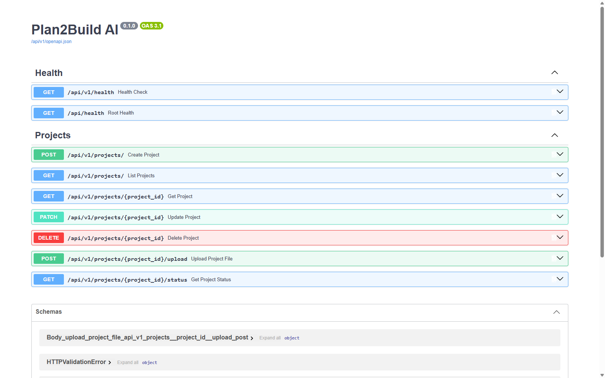

# 🏢 Plan2Build AI — AI Floor Plan → Editable 3D Building

[](https://fastapi.tiangolo.com)
[](https://reactjs.org)
[](https://threejs.org)
[](https://www.typescriptlang.org)
[](https://tailwindcss.com)
[](https://opensource.org/licenses/MIT)

**Plan2Build AI** is a production-grade architectural AI and computational geometry platform that converts 2D raster floor-plan images/PDFs into verified, canonical semantic building representations and reconstructs them into editable 3D buildings in an interactive WebGL CAD environment.

👉 **[Master Phases & Progress Roadmap (47 Phases)](docs/roadmap_checklist.md)** — Track project development status and resumption instructions across all engineering phases.

---

## 📸 Application Showcase (Live Running Studio)

### 1. Interactive 3D WebGL Building Viewport
Parametric 3D building reconstruction featuring extruded walls with clean door/window boolean cutouts, wood floor slabs, open door leaves, framed glass windows, and real-time directional sunlight with soft cast shadows.



---

### 2. Dual 2D CAD & 3D Split Viewport
Live synchronized dual-view editing allowing simultaneous 2D architectural blueprint adjustments and real-time 3D WebGL model inspection.



---

### 3. Interactive 2D Vector CAD Canvas
Precision 2D CAD viewport featuring vector wall centerlines with thickness, automatic room polygon segmentation with live area calculations ($m^2$), door swing arcs, window openings, column joints, and real-time Building Overview metrics.



---

### 4. Multi-Format Floor Plan Ingestion & Dropzone
Accepts architectural raster images (PNG, JPG, JPEG) and multi-page architectural PDFs up to 50MB with instant preview, resolution normalization, and one-click sample benchmark fixtures.



---

### 5. Project Manager & Database Persistence
Full project lifecycle management backed by Async SQLAlchemy (SQLite/PostgreSQL) with real-time status tracking (`CREATED` ➔ `UPLOADED` ➔ `PREPROCESSING` ➔ `DETECTING` ➔ `SEGMENTING` ➔ `RECONSTRUCTING` ➔ `GENERATING_3D` ➔ `READY`).



---

### 6. AI Architect Assistant
Structured natural language conversational assistant for architectural layout modifications, spatial ratio evaluations, and design guideline compliance.



---

### 7. Backend REST API & OpenAPI Documentation
Async FastAPI backend providing high-throughput endpoints for project CRUD, multipart uploads, geometry serialization, and background perception tasks.



---

## 🏛️ System Architecture Overview

The system strictly decouples **AI Perception** (probabilistic) from the **Deterministic 3D Geometry Engine**, bridged by the **Canonical Semantic Floor Plan (SSOT)**:

```text
                      ┌─────────────────────────────────┐
                      │ 2D Floor Plan (PNG / JPG / PDF) │
                      └────────────────┬────────────────┘
                                       │
                                       ▼
                      ┌─────────────────────────────────┐
                      │    OpenCV / AI Perception       │
                      │    - Adaptive Thresholding      │
                      │    - Line Segment Vectorization │
                      │    - Room Polygon Segmentation  │
                      │    - OCR Text & Label Mapping   │
                      │    - Scale & Dimension Inference│
                      └────────────────┬────────────────┘
                                       │
                                       ▼
                      ┌─────────────────────────────────┐
                      │   Semantic Floor Plan (SSOT)    │
                      │   Canonical JSON Specification  │
                      └────────────────┬────────────────┘
                                       │
                                       ▼
                      ┌─────────────────────────────────┐
                      │   Geometric & Rule Validator    │
                      │   - Manifoldness & Intersections│
                      │   - Door / Window Clearances    │
                      │   - Habitable Area Compliance   │
                      └────────────────┬────────────────┘
                                       │
                                       ▼
                      ┌─────────────────────────────────┐
                      │   Deterministic 3D Extrusion    │
                      │   - CSG Boolean Wall Cutouts    │
                      │   - Parametric Slabs & Ceilings │
                      │   - Doors, Windows & Furniture  │
                      └────────────────┬────────────────┘
                                       │
                                       ▼
                      ┌─────────────────────────────────┐
                      │   Three.js / R3F CAD Studio     │
                      │   - Dual 2D / 3D Split Viewport │
                      │   - Real-time Bidirectional Sync│
                      │   - Solar Sun & Night Sim       │
                      │   - GLB / OBJ / JSON Export     │
                      └─────────────────────────────────┘
```

---

## ✨ Core Features

| Feature | Description |
| :--- | :--- |
| **🖼️ Multi-Format Ingestion** | Accepts PNG, JPG, JPEG, and multi-page architectural PDF files up to 50MB. |
| **📐 Precision 2D CAD** | Interactive SVG canvas with pan, zoom, snapping grid, wall drawing, and underlay opacity slider. |
| **🏗️ Parametric 3D Extrusion** | Clean boolean cutouts for doors and windows with sill and lintel header sub-meshes. |
| **🛋️ Furniture Layout** | Procedural furniture library (beds, sofas, dining tables, kitchen counters, bathroom vanities). |
| **☀️ Solar & Lighting Engine** | Interactive sun azimuth & elevation controls, realistic shadows, and ambient night mode. |
| **🤖 AI Architect Assistant** | Structured natural language layout modifications and design rule validation. |
| **💾 Multi-Database Ready** | Async SQLAlchemy engine supporting SQLite (local standalone) and PostgreSQL (production). |
| **📦 Production Export** | Export canonical semantic floor plan JSON, 3D GLB/GLTF models, and OBJ assets. |

---

## ⚡ Quickstart Guide

### Prerequisites
- **Python**: 3.11 or newer
- **Node.js**: 18.0 or newer and npm

### 1. Clone Repository
```bash
git clone https://github.com/aditya0589/plan2build.git
cd plan2build
```

### 2. Start Backend API (FastAPI)
```bash
cd apps/api
python -m pip install -r requirements.txt
python -m pytest -v
python -m uvicorn app.main:app --host 127.0.0.1 --port 8000 --reload
```
- **Backend API**: `http://127.0.0.1:8000`
- **Interactive Swagger Docs**: `http://127.0.0.1:8000/docs`
- **Health Check**: `http://127.0.0.1:8000/api/health`

### 3. Start Frontend Studio (React Three Fiber + Vite)
```bash
cd apps/web
npm install
npm run dev
```
- **Studio Web App**: `http://localhost:5173`

### 4. Docker Compose (Full Stack)
```bash
docker-compose up --build
```

---

## 📁 Repository Structure

```text
plan2build/
├── apps/
│   ├── web/                    # React 18 + Vite + Three.js + R3F + Tailwind + Zustand
│   │   ├── src/
│   │   │   ├── components/     # Header, Toolbar, Properties Inspector, Layer Manager
│   │   │   ├── features/       # 2D CAD canvas, 3D R3F Viewport, Upload modal, Project Manager
│   │   │   ├── stores/         # Zustand stores (projectStore, floorplanStore, viewerStore)
│   │   │   └── types/          # Canonical TypeScript contracts
│   │   └── package.json
│   └── api/                    # FastAPI + Async SQLAlchemy + OpenCV + Shapely + PIL
│       ├── app/
│       │   ├── api/v1/         # Health & Project CRUD endpoints
│       │   ├── core/           # Config, database engine, storage abstraction, logging
│       │   ├── models/         # SQLAlchemy ORM models (Project)
│       │   ├── schemas/        # Canonical Pydantic floor plan and validation schemas
│       │   ├── services/       # Business logic (ProjectService, UploadService)
│       │   └── tests/          # Pytest automated test suite
│       └── requirements.txt
├── packages/
│   └── shared-types/           # Shared TypeScript schema definitions
├── data/
│   ├── uploads/                # User uploaded raw images and PDFs
│   ├── processed/              # Binarized line masks and vector extractions
│   ├── examples/               # Standard architectural benchmark fixtures
│   └── outputs/                # Exported 3D GLB/OBJ models
├── docs/
│   ├── assets/                 # Actual application screenshots
│   ├── roadmap_checklist.md    # Master 47-phase development roadmap
│   ├── architecture.md         # Complete system architecture specification
│   ├── pipeline.md             # 12-stage perception and reconstruction pipeline
│   └── floorplan-schema.md     # Canonical Semantic Floor Plan JSON schema
├── docker-compose.yml
├── .env.example
└── README.md
```

---

## 📚 Technical Documentation

- **[System Architecture Spec](docs/architecture.md)** — Architectural principles, dataflow, and boundaries.
- **[Perception & 3D Pipeline Spec](docs/pipeline.md)** — 12-stage computer vision and geometric extrusion pipeline.
- **[Canonical Floor Plan Schema](docs/floorplan-schema.md)** — JSON specification for rooms, walls, doors, windows, and levels.
- **[Master Roadmap Checklist](docs/roadmap_checklist.md)** — Interactive 47-phase engineering milestones.

---

## 📜 License

This project is licensed under the MIT License — see the [LICENSE](LICENSE) file for details.